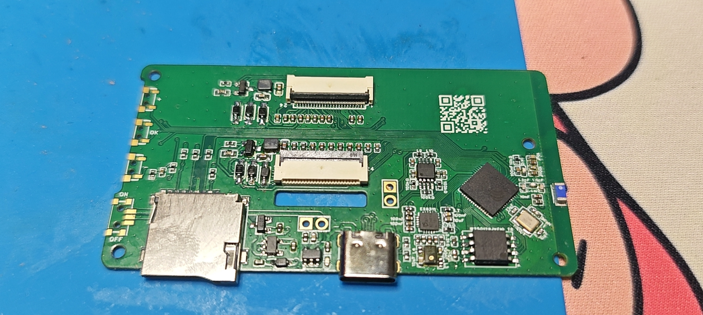
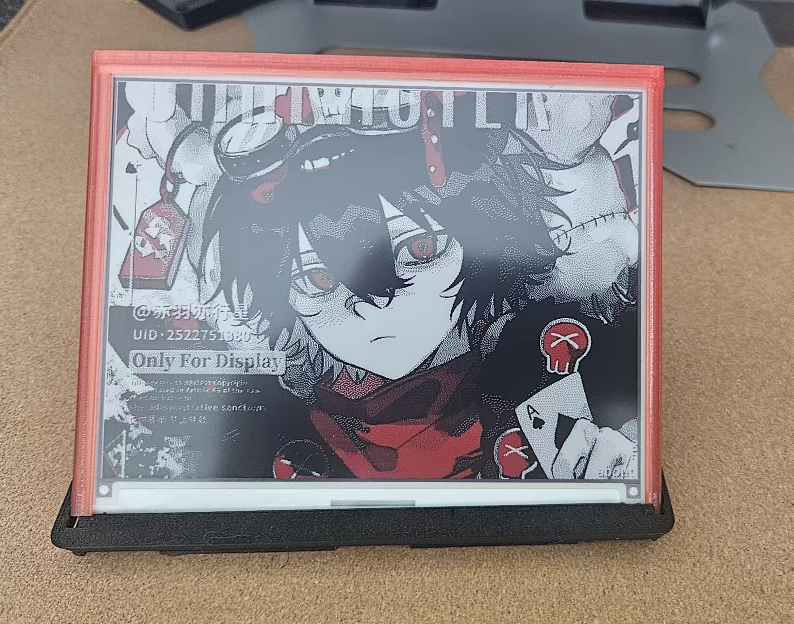
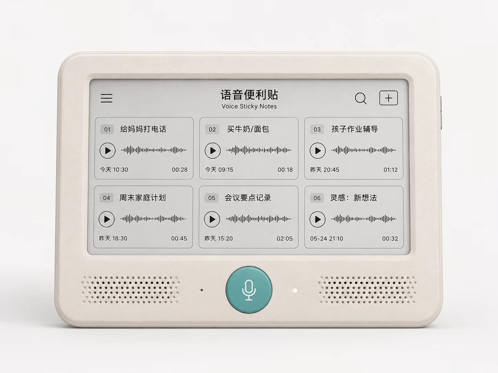

# 小悟 ESP32-S3 双屏电子纸智能终端

（中文 | [English](README.md)）

## 项目概述

小悟是一款基于 ESP32-S3 自主研发的一体化双屏电子纸智能终端。主板可独立驱动
A、B 两块 24Pin 电子纸屏；搭配 24Pin 转 50Pin 扩展板，还可驱动 7 英寸
E Ink E6 电子纸屏。

固件将电子纸信息展示、语音交互、本地媒体存储和智能家居控制整合在同一设备中，
适用于桌面信息终端、课程助手、家庭中控和低功耗信息看板等场景。

## 核心功能

- 一体双屏驱动：支持 A、B 两块 24Pin 电子纸屏独立显示
- 大屏扩展：通过 24Pin 转 50Pin 子板驱动 7 英寸 E Ink E6 屏幕
- 信息应用：相册、日历、课程表、便签、电子书和 Token 余额看板
- 图片管理：支持远程下发图片及从 TF/microSD 卡播放本地图片
- 语音能力：支持小智语音交互、音频录制及本地音频播放
- 智能家居：连接本地 Home Assistant，控制局域网内物联网设备

> 电子书功能需要支持快速刷新的电子纸屏；不同屏幕和转接板组合以实板测试结果为准。

## 自研硬件

主板集成双路 24Pin 电子纸接口、音频输入输出、TF/microSD 卡、USB-C 和
ESP32-S3 主控，并支持专用 24Pin 转 50Pin 电子纸扩展板。

<table>
  <tr>
    <td align="center"> <b>ESP32-S3 双屏主控板</b></td>
    <td align="center"> <b>7 英寸 E Ink E6 屏幕显示</b></td>
  </tr>
  <tr>
    <td colspan="2" align="center"> <b>小悟语音电子纸终端</b></td>
  </tr>
</table>

## 介绍

[https://upisqueen-blip.github.io/xiaowu/](https://upisqueen-blip.github.io/xiaowu/)
